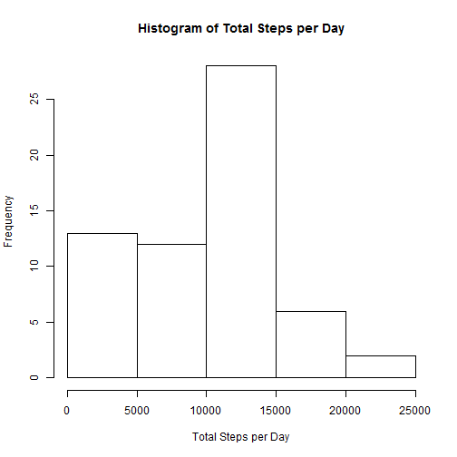
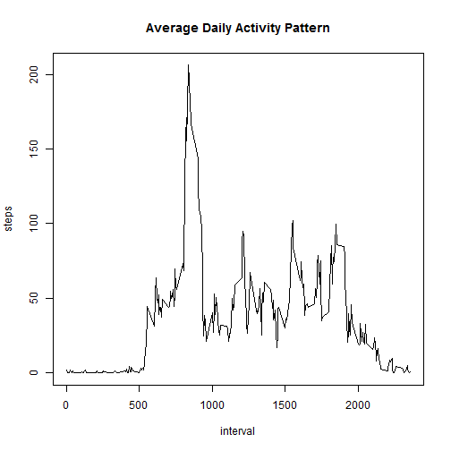
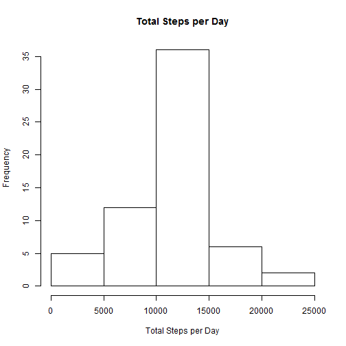
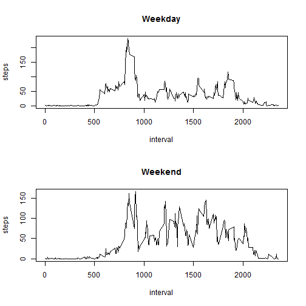

Reproducible Research: Peer Assessment 1
========================================

## Loading and preprocessing the data
Load the activity.csv data and summary the data

```r
data <- read.csv("activity.csv")
summary(data)
```

```
##      steps                date          interval     
##  Min.   :  0.00   2012-10-01:  288   Min.   :   0.0  
##  1st Qu.:  0.00   2012-10-02:  288   1st Qu.: 588.8  
##  Median :  0.00   2012-10-03:  288   Median :1177.5  
##  Mean   : 37.38   2012-10-04:  288   Mean   :1177.5  
##  3rd Qu.: 12.00   2012-10-05:  288   3rd Qu.:1766.2  
##  Max.   :806.00   2012-10-06:  288   Max.   :2355.0  
##  NA's   :2304     (Other)   :15840
```

## What is mean total number of steps taken per day?
Calculate the total number of steps taken per day

```r
library(dplyr)
totalsteps_perday <- aggregate(x = data$steps, by = list(data$date), FUN = "sum", na.rm = TRUE)
totalsteps_perday <- rename(totalsteps_perday, date=Group.1, steps=x)
```
Take a histogram of the total number of steps taken each day

```r
hist(totalsteps_perday$steps, main = "Histogram of Total Steps per Day", xlab = "Total Steps per Day")
```

 

Calculate and report the mean and median of the total number of steps taken per day

```r
mean(totalsteps_perday$steps)
```

```
## [1] 9354.23
```

```r
median(totalsteps_perday$steps)
```

```
## [1] 10395
```

## What is the average daily activity pattern?
Calculate the average number of steps taken, averaged across all days

```r
avgsteps <- aggregate(x = data$steps, by = list(data$interval), FUN = "mean", na.rm = TRUE)
avgsteps <- rename(avgsteps, interval=Group.1, steps=x)
```
Make a time series plot: x-axis is interval, y-axis is average steps across all days

```r
plot(avgsteps$interval, avgsteps$steps, type = "l", pch = 19, main = "Average Daily Activity Pattern", 
     xlab = "interval", ylab = "steps")
```

 

Which 5-minute interval, on average across all the days in the dataset, contains the maximum number of steps?

```r
maxinterval <- avgsteps[avgsteps$steps == max(avgsteps$steps),]$interval
maxinterval
```

```
## [1] 835
```

## Imputing missing values
Note that there are a number of days/intervals where there are missing values (coded as NA). The presence of missing days may introduce bias into some calculations or summaries of the data.

Calculate and report the total number of missing values in the dataset

```r
table(is.na(data$steps))
```

```
## 
## FALSE  TRUE 
## 15264  2304
```
Create a new dataset that is equal to the original dataset but with the missing data filled in. Devise a strategy for filling in all of the missing values in the dataset.Use the mean for that 5-minutes interval to replace NA.

```r
data2 <- data
for (interval in unique(data2$interval))
    data2[data2$interval == interval & is.na(data2$steps),'steps'] = avgsteps[ avgsteps$interval == interval , 'steps']       
```

Calculate the total number of steps taken per day

```r
totalsteps_perday2 <- aggregate(x = data2$steps, by = list(data2$date), FUN = "sum", na.rm = TRUE)
totalsteps_perday2 <- rename(totalsteps_perday2, date=Group.1, steps=x)
```
Take a histogram of the total number of steps taken each day

```r
hist(totalsteps_perday2$steps, main = "Total Steps per Day", xlab = "Total Steps per Day")
```

 

Calculate and report the mean and median of the total number of steps taken per day

```r
mean(totalsteps_perday2$steps)
```

```
## [1] 10766.19
```

```r
median(totalsteps_perday2$steps)
```

```
## [1] 10766.19
```
Do these values differ from the estimates from the first part of the assignment? What is the impact of imputing missing data on the estimates of the total daily number of steps?

```r
mean(totalsteps_perday2$steps)-mean(totalsteps_perday$steps)
```

```
## [1] 1411.959
```

```r
median(totalsteps_perday2$steps)-median(totalsteps_perday$steps)
```

```
## [1] 371.1887
```
From above results, we know that the mean and median values differ from those from the first part of the assignment. It seems that missing data (NA) increase the frequency of steps.

## Are there differences in activity patterns between weekdays and weekends?

Create a new factor variable in the dataset with two levels - "weekday" and "weekend" indicating whether a given date is a weekday or weekend day.

```r
data2$day <- ifelse(weekdays(as.Date(data2$date),abbreviate = TRUE) %in% c("Sat","Sun"), "weekend", "weekday")
```
Make a panel plot containing a time series plot of the 5-minute interval (x-axis) and the average number of steps taken, averaged across all weekday days or weekend days (y-axis).

```r
weekdaysteps <- aggregate(x=data2$steps, by=list(data2$day,data2$interval), FUN="mean")
weekdaysteps <- rename(weekdaysteps, day=Group.1, interval=Group.2, steps=x)

par(mfrow = c(2,1))
plot(weekdaysteps[weekdaysteps$day=="weekend",'interval'], weekdaysteps[weekdaysteps$day=="weekday",'steps'], type = "l", pch = 19, main = "Weekday", xlab = "interval", ylab = "steps")

plot(weekdaysteps[weekdaysteps$day=="weekday",'interval'], weekdaysteps[weekdaysteps$day=="weekend",'steps'], type = "l", pch = 19, main = "Weekend", xlab = "interval", ylab = "steps")
```

 

From above plots, we know that there are differences in activity patterns between weekdays and weekends.
